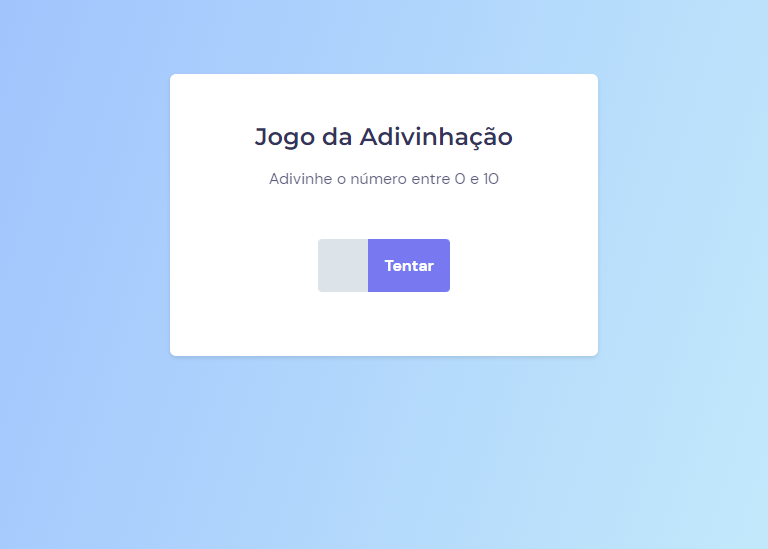

  

	
<h4 align="center"> 
	🚀 Projeto 10 | Stage 05 - Explorer
</h4>

  

  
  
  
  
  <a href="https://laurirodrigues.github.io/Jogo-da-adivinhacao/"> ▶️ Visualizar Deploy </a>

<h2 align=left> 💻 Sobre o projeto </h3>

 Projeto realizado durante o programa <strong>Explorer</strong> da <a href="https://www.rocketseat.com.br/"> <strong>Rocketseat</strong> </a>. É o décimo projeto do programa, localizado no nível 5, onde construímos um jogo para conhecer conceitos e manipulação de DOM, funções callbacks e eventos.  

  
<h2 align=left> 🛠 Tecnologias utilizadas </h3>

  
  
  

<h2 align=left> 🎨 Layout </h2>
<a href="https://www.figma.com/file/7EeTKuevVMczzgTV90cibn/Jogo-Adivinha%C3%A7%C3%A3o-(Copy)?node-id=0%3A1"> Visualizar no Figma </a>  

<h4>💻 Desktop </h4>

